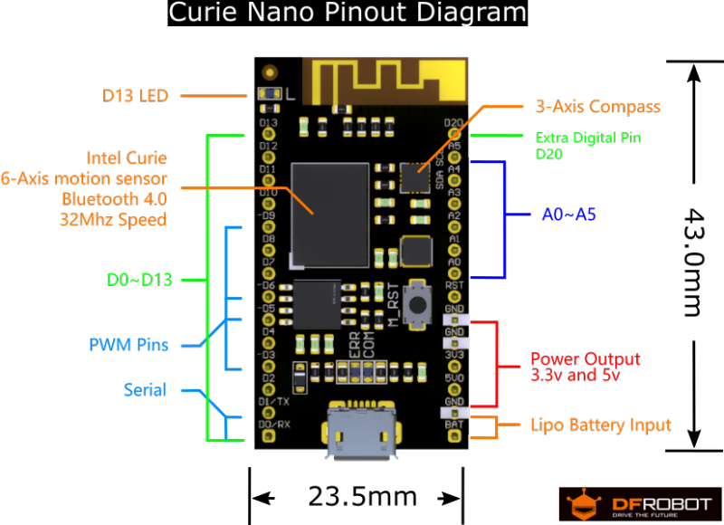

# CoachT

CoachT is an AI assistant for tennis players. It is built with an Intel Curie chip that is placed on a tennis racket.
The chip has built in acceleration sensor and neural net implemented in hardware in addition to a normal Arduino board.

The machine learning is carried out in the following steps:

1. Acceleration reading is collected by sampling when professional players swing shots and labelled into six groups.
2. Using these data the on-board neuaral net is trained.
3. Using the model trained normal players swings are compared against professional players' swing and result is 
   outputed into one of the six groups.

## Code organization
* Data preprocessing is done [here](https://github.com/Eskender-B/coachT-Preprocess)
* The code is written as an Arduino library in [CoachT/](CoachT)
* The final zipped file is located at [CoachT.zip](CoachT.zip)
* The training data and an already trained model is found at [sdcard/](sdcard/) to be loaded
  on an SD card attached to the board.
	* Training data at [sdcard/coachT/data/train/](sdcard/coachT/data/train/)
	* Test data at [sdcard/coachT/data/test/](sdcard/coachT/data/test/)
	* Already trained model to be used by the library at [sdcard/coachT/MODEL.DAT](sdcard/coachT/MODEL.DAT)
* Examples of how to use the library [CoachT/examples/](CoachT/examples/)

## Usage

* Load the zipped library from Arduino IDE
* And see the examples

## Reference

* Documentation for using the chip found [here](https://www.general-vision.com/docs/)
 
